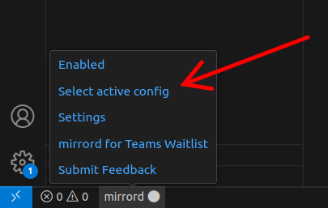

# Configuration

mirrord offers rich [configuration options](https://mirrord.dev/docs/overview/configuration/). The easiest way to configure how mirrord manages the context of your application is to provide a configuration file.

When no configuration file is specified, mirrord uses the first one found in the `.mirrord` directory. If there is none, one is created automatically:

```json
{
    "accept_invalid_certificates": false,
    "feature": {
        "network": {
            "incoming": "mirror",
            "outgoing": true
        },
        "fs": "read",
        "env": true
    }
}
```

# Using multiple configurations

You can specify configuration file to use for specific the launch configuration. To do this, pass the path to the file in the `MIRRORD_CONFIG_FILE` environment variable:

```json
{
    "version": "0.2.0",
    "configurations": [
        {
            "name": "Python: Current File",
            "type": "python",
            "request": "launch",
            "program": "${file}",
            "console": "integratedTerminal",
            "justMyCode": true,
            "env": {
                "MIRRORD_CONFIG_FILE": ".mirrord/sample_mirrord.json"
            }
        }
    ]
}

```

# Active config feature

You can also temporarily override the configuration file used by setting the active config.


