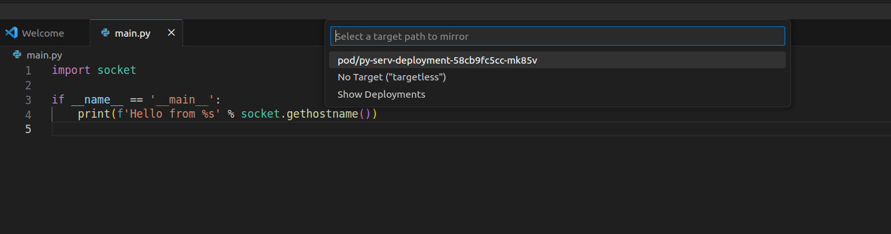

# Debug application with enabled mirroring

Start debugging your application. Target selection should appear at the top of the VS Code window (this step will be skipped if your mirrord configuration already specifies the target).

Choose the target you want to impersonate, or run your application in targetless mode. Your application will simply run in the context of the selected target or in general context of the cluster.
